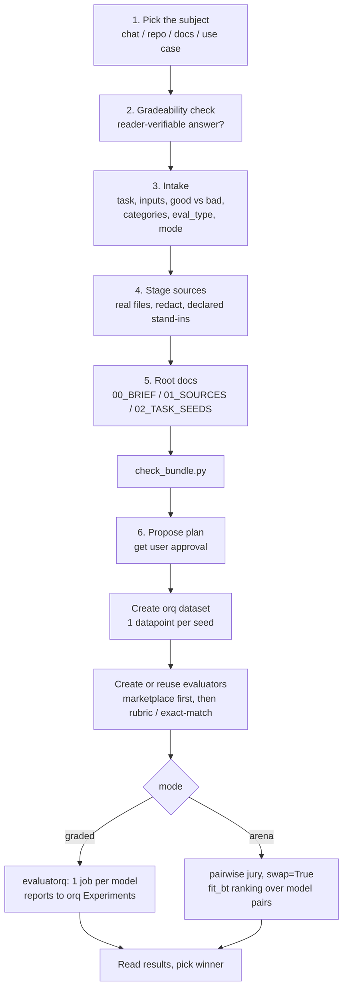

# orq build benchmark

Use when a user wants to know which model or agent is best at *their* task,
measured on *their* work. You interview them, stage real task instances with
established answers, and then build the benchmark on orq directly: an orq
dataset, orq evaluators, and a run with evaluatorq that reports to orq
Experiments. There is no third-party upload; everything lands in the user's
own orq workspace.

## At a glance

The skill turns work the team already did into a model benchmark that lives on orq:

```text
  team's real work            curated bundle            orq dataset
  ────────────────            ──────────────            ───────────
  chat / repo / docs   ──►    real task instances  ──►  1 datapoint
  tickets / orq Traces        + redacted stand-ins      per seed,
  (what actually shipped)     + root docs, checked       expected answer
                                    │
                                    ▼
                           benchmark design
                           (you propose, user approves)
                                    │
                    ┌───────────────┴───────────────┐
                    ▼                                ▼
              graded run                        arena run
              (fixed answer:                    (no fixed answer:
              rubric / exact-match)             pairwise jury, swap)
                    │                                │
                    ▼                                ▼
              evaluatorq run                   evaluatorq run
              1 job per model                  compare() per pair
                    │                                │
                    ▼                                ▼
              orq Experiments                  win rates + BT ranking
              (per-category scores)            (fit_bt over the pairs)
                    └───────────────┬───────────────┘
                                    ▼
                       read results, pick the winner
```

Stages 1 to 5 (subject, gradeability, intake, staging, root docs) are shared; the
run stage forks by mode. The detailed step diagram is under [The flow](#the-flow).

This is the orq port of Artificial Analysis's `optima-eval-prep`. Steps 1 to 5
(pick the subject, check gradeability, intake, stage sources, write the root
docs) are the same work and where most of the value is. Step 6 is replaced:
instead of packaging a ZIP for an external platform, you design the benchmark
yourself (with user approval) and build it on orq.

## Two ways to grade

Pick the mode during intake; it changes only the run step, not the staging.

- **Graded benchmark (absolute).** Each model answers, and each answer is scored
  on its own against a known correct answer, with a rubric judge or exact-match.
  Use this when the task has a fixed right answer you can stage (a figure, a
  clause, a label, an accepted output). This is the default.
- **Arena (pairwise).** Each model answers, then models are judged head to head
  and rolled up into win rates and a ranking. Use this when the task has no single
  right answer but a person can still say which of two answers is better (writing
  quality, tone, "which reply is more helpful"). No established answer is needed.

Both modes stage the same sources and build the same orq dataset. When in doubt
and a fixed answer exists, use the graded benchmark; reach for the arena only
when quality is a matter of preference. You can run both on the same dataset.

## The flow



## Rules

- If the request names no subject, ask one question first and nothing else.
  When you are already in the user's repo, offer it as an option rather than
  asking to be pointed at one. When this conversation contains real work, name
  it and offer it as the default: "Want the benchmark built from what we did
  in this chat (the actual work)? Or from this repo, a folder of documents or
  tickets you point me at, or a use case you describe?"
- Give the benchmark concrete material: real instances paired with the outputs
  that were accepted, established answers with their evidence, and the mistakes
  people actually make. The benchmark can only be as specific as what you stage.
- Never upload or commit uncleared confidential material. Replace confidential
  documents with generated stand-ins that keep the real structure, field names,
  length, and messiness, and declare every stand-in in the manifest.
- Never name a file you did not create. If you generate a stand-in, write the
  actual file.
- You design the benchmark for now (task count, categories, rubric), but you do
  not finalize it silently. Show the plan and get approval before building on orq.

## What the grader can check

The grader is an orq evaluator. It reads the answer; it never executes it. For a
graded benchmark, a use case only works if a fixed right answer can be verified by
reading. Check this before staging anything. If a use case has no fixed answer but
a reader can still say which of two answers is better, it is not out of scope: run
it as an arena instead (see the run step). If it fails both, say so and propose the
nearest gradeable reformulation.

Two things fail it:

- Anything graded by execution ("passes the test suite", "returns the right
  rows") has to be restated toward what reading can verify, with a note on what
  is no longer measured.
- Anything needing bespoke tools or systems (an internal API, a live database)
  has to be restated around supplied files.

An answer that moves over time is not gradeable ("what is the share price
today"). An answer that is fixed once the inputs are attached is fine
("summarise this filing" when you attach the filing and grade against it).
File-producing work is fine: a task whose answer is a spreadsheet, a document,
or code files is a normal `agentic` task, graded by a rubric judge reading the
produced artifact.

## Intake

Pin down:

1. The work: what the org does, and the one repeating task worth measuring.
2. The inputs: what a real instance arrives with, in which formats, roughly how long.
3. Good vs bad in the user's words, as concrete observations ("reviewers reject
   answers that miss the auto-renewal clause"). These become rubric criteria, so
   prefer specific and evidenced over general.
4. The answer shape: a short written answer, a filled document, a label from a
   fixed set (get the exact set), or a produced file.
5. Categories: the 2 or more meaningfully different kinds of this work.
6. Scale and confidentiality: how many tasks, and which material cannot be used as-is.
7. The evaluation type, agreed with the user:
   - `qa`: every answer is plain text with no attached inputs.
   - `document_input`: every answer is plain text about attached files.
   - `agentic`: any task's required output is anything other than plain text in a
     reply (a spreadsheet, a document, a slide deck, code files, any produced file).
   When in doubt, `agentic`. Record the type; it drives how the dataset and
   evaluators are built below.
8. The grading mode: `graded` (there is a fixed right answer to score against) or
   `arena` (no single right answer, but a judge can pick the better of two). If
   the good vs bad in item 3 reads as pass/fail against facts, use `graded`; if it
   reads as "better/worse" on quality or tone, use `arena`. Record it.

When working from a repo or chat, name the repeating unit of work ("review one
pull request", not "do what this conversation did"). Find more instances of that
unit in history and files; each becomes a task. Follow-up fixes are especially
useful: each points at the change that introduced a defect, so it gives you an
instance and its correct answer together. Include instances where the right
answer is "nothing to report"; without clean inputs the benchmark cannot
penalize invented findings.

## Stage the sources

Stage into a working directory (default `benchmark_bundle/`):

- Use real files where possible. Redact rather than fabricate when redaction is enough.
- Generate stand-ins for what cannot go. Write the actual file with code; never
  name a file you did not create. Keep the stand-in as long and messy as the real thing.
- Every filename says what the file is: `supplier_contract_signed_2024.pdf`, not `doc1.pdf`.
- Group into folders by kind: `contracts/`, `claims/`, `examples/`.
- Put worked examples in `examples/`: a past input paired with the output a senior
  person actually produced.
- Put outcome evidence in its own folder: follow-up fixes, post-mortems, reviewer
  rejections. These record what the right answer turned out to be without being
  answers themselves. Say in the manifest what each item is evidence of, and use
  it for grading, never as task input.
- Do the task yourself where the answer is checkable: compute the figure, find the
  clause, assign the label. Record the result in `02_TASK_SEEDS.md` with its evidence.

## Root documents

Three files at the bundle root. Numeric prefixes make them sort first.

`00_BRIEF.md` describes the work, not the benchmark. Drop empty sections rather
than padding them:

```markdown
# <What the org does, in a sentence>

## The task we want measured
<The repeating job: what arrives, what has to come out, what makes it hard.>

## What's attached
<The bundle at folder level: what is real, redacted, or generated, and why.>

## What a good answer looks like
<Concrete and evidenced, in the org's own words.>

## What a weak answer looks like
<Mistakes actually seen. "Misses the auto-renewal clause because it sits under
Termination" beats "incomplete analysis".>

## How this work divides
<The categories.>

## The shape of an answer
<Written answer / filled document / label from the exact fixed set / file.>

## Scale
<How many tasks.>
```

`01_SOURCES.md` is the manifest. One entry per file: path, what it is, provenance
(real, redacted, or generated), and what to notice about it. Where a file
establishes a right answer, cross-reference its entry in `02_TASK_SEEDS.md`.

`02_TASK_SEEDS.md` has one entry per candidate instance of the work:

- input files (bundle paths);
- the established answer or accepted output, or a pointer into `examples/`. An
  `arena` row has no single right answer: instead record the better-vs-worse
  observations the judge should weigh (what makes one reply stronger), which become
  the pairwise criteria in 4b;
- the evidence, quoted or located exactly: `adjusted balance is $842,317.44
  (Reconciliation!D48 in claims/ledger_q4.xlsx)`;
- wrong answers seen, or plausible near-misses worth penalizing;
- the category.

State facts with evidence, not scoring scales. Include the clean instances where
the right answer is "nothing to report".

## Validate the bundle

Before building on orq, run the checker next to this file on the staged directory:

```bash
python <this skill's directory>/scripts/check_bundle.py <bundle-dir>
```

It confirms the three root docs are present, that `02_TASK_SEEDS.md` has seeds,
that filenames are self-describing, that no file is too large to ingest cleanly,
and it flags common uncleared-confidential markers so nothing private slips in.
Exit 0 means shippable (warnings may still print); exit 1 means fix first; exit 2
means wrong usage (you did not pass exactly one argument, or it is not a directory).

Also confirm by eye: every filename self-describing; provenance stated for every
file; nothing confidential the user has not cleared; every known answer in
`02_TASK_SEEDS.md` with its evidence; every input the brief names is in the
bundle, or the brief says the task was restated without it.

## Build on orq

This replaces Optima's package-and-upload step. Do it in order.

### 1. Propose the plan and get approval

From the seeds, propose: the task count, the categories, and the grading rubric
(criteria drawn verbatim from the "good vs bad" observations in intake). For
fixed label sets, name exact-match as the grader. Show this to the user and get
approval before creating anything. Do not create orq objects until they say yes.

### 2. Create the orq dataset

One datapoint per task seed. Use the orq MCP tools (`create_dataset` then
`create_datapoints`) or the orq CLI.

- `inputs`: the task input. For `qa`, the question text. For `document_input`,
  the question plus the attached file content (or a reference the job can load).
  For `agentic`, the instruction plus any input files.
- `expected_output`: the established answer from the seed. For `agentic`
  file-producing tasks, put the acceptance criteria or a pointer to the accepted
  artifact here; the rubric judge grades the produced file against it.
- `metadata`: `category`, `evidence` (the exact quote or cell reference), and
  `eval_type`.

### 3. Create or reuse the evaluators

Check the marketplace first, then fill the gaps.

- Reuse from the marketplace. Search existing workspace evaluators with
  `search_entities` (type `evaluator`), and browse the built-in hub templates
  (`GET /evals/templates`). A built-in function evaluator (for example
  `orq_pii_detection`, `valid_json`, `orq_harmful_moderation`) attaches with no
  configuration. A hub LLM-judge or Ragas template needs configuration, so it must
  be imported into the workspace first, which makes it an evaluator entity you can
  then attach by id. Prefer reusing a marketplace evaluator over writing a new one
  when it fits the criteria.
- Rubric judge, when no marketplace evaluator fits: an LLM evaluator whose criteria
  are the "good vs bad" observations. Build it with `create_llm_eval` (orq MCP) or
  evaluatorq's `llm_jury` at run time. (There is also an `orq-build-evaluator` skill,
  but it lives in the `orq-ai/assistant-plugins` repo, not here, so reach for it only
  if that plugin set is installed.)
- Exact-match for fixed label sets: the built-in `exact_match` evaluator (orq), or
  evaluatorq's `exact_match_evaluator()`.

### 4. Prerequisite: a current evaluatorq

Both templates below import evaluatorq. They need a recent build that exports
`evaluatorq`, `job`, `llm_jury`, `exact_match_evaluator`, and `DatasetIdInput`
(graded) plus `llm_jury_pairwise`, `fit_bt`, and `JudgedComparison` (arena). Install
the current package from `orq-ai/evaluatorq` (`uv add "evaluatorq @ git+https://github.com/orq-ai/evaluatorq"`,
or a published release once available). The older evaluatorq bundled in `orqkit` does
not export all of these, so a template run fails at import against it. Confirm with
`python -c "import evaluatorq; evaluatorq.fit_bt; evaluatorq.llm_jury"` before running.

### 4a. Graded mode: run the candidates with evaluatorq

Use this when the mode is `graded`. One `evaluatorq()` call, one job per candidate
model or agent, evaluated on the dataset. Results upload to orq Experiments when
`ORQ_API_KEY` is set. Template, grounded in the current evaluatorq API:

```python
import asyncio
from evaluatorq import DatasetIdInput, evaluatorq, exact_match_evaluator, job, llm_jury

CANDIDATES = ['openai/gpt-5', 'anthropic/claude-opus-4-1', 'google-ai/gemini-2.5-pro']

def make_job(model: str):
    @job(model)
    async def run(dp, _i):
        # call_model: define this yourself. Invoke the candidate on the datapoint
        # input via your orq client / invoke_model and return its text output; keep
        # every candidate identical except the model id. This example dataset uses a
        # single 'text' input column (see step 2), so dp.inputs['text'] is the prompt.
        return await call_model(model, dp.inputs['text'])
    return run

rubric = llm_jury(
    name='task-rubric',
    criteria=(
        'Score the answer against these criteria drawn from the team\'s own review notes:\n'
        '- <criterion 1 from intake>\n- <criterion 2 from intake>\n...'
    ),
    verdict_kind='numeric',
    model='openai/gpt-5',
)

async def main():
    await evaluatorq(
        'our-task-benchmark',
        data=DatasetIdInput(dataset_id='<orq_dataset_id>'),
        jobs=[make_job(m) for m in CANDIDATES],
        evaluators=[rubric],            # add exact_match_evaluator() for fixed-label tasks
        description='Which model is best at <our task>',
    )

asyncio.run(main())
```

Every job runs against every datapoint, so each candidate is one column. Verify
the candidate model ids against `list_models` (orq MCP) before running; do not
invent model ids.

### 4b. Arena mode: pairwise ranking

Use this when the mode is `arena` (no fixed right answer, but a judge can pick the
better of two). Same dataset. Each candidate answers every input, then the answers
are judged head to head and rolled up into win rates. This is the same method as
the research win-rate arena (RES-759): evaluatorq's pairwise jury with position-bias
correction (`swap=True`). Template, grounded in the current evaluatorq API:

With more than two candidates you want ONE ranking across all of them, not a pile
of per-pair win rates. `build_report` aggregates by the positional A/B slot, so a
flat list mixing different model pairs is meaningless (it would add gpt-vs-claude
into the same "A" bucket as claude-vs-gemini). The evaluatorq way to rank N models
is `fit_bt`: map each judge vote to a `JudgedComparison` keyed on the two model ids,
then fit Bradley-Terry once over all of them. Template, grounded in the current
evaluatorq API (mirrors `examples/pairwise/bt_sigma_ranking.py`):

```python
import asyncio
from evaluatorq import JudgedComparison, fit_bt, llm_jury_pairwise

CANDIDATES = ['openai/gpt-5', 'anthropic/claude-opus-4-1', 'google-ai/gemini-2.5-pro']

comparator = llm_jury_pairwise(
    judges=['openai/gpt-5', 'anthropic/claude-opus-4-1', 'google-ai/gemini-2.5-pro'],
    criteria='Prefer the answer that ... <the better/worse observations from intake>',
    swap=True,  # judge each pair both ways to cancel position bias
)

# load_datapoints and call_model: define these yourself. load_datapoints fetches the
# dataset you created in step 2 (orq MCP list_datapoints / the orq CLI) as evaluatorq
# DataPoints; call_model invokes one candidate and returns its text output. This
# example dataset uses a single 'text' input column (see step 2), so dp.inputs['text']
# is the prompt.
VOTE_TO_P = {'A': 1.0, 'B': 0.0, 'tie': 0.5}

async def main():
    datapoints = load_datapoints('<orq_dataset_id>')
    answers = {m: [await call_model(m, dp.inputs['text']) for dp in datapoints] for m in CANDIDATES}

    records: list[JudgedComparison] = []
    for i, dp in enumerate(datapoints):
        for a in range(len(CANDIDATES)):
            for b in range(a + 1, len(CANDIDATES)):
                model_a, model_b = CANDIDATES[a], CANDIDATES[b]
                comparison = await comparator.compare(
                    # compare() wants a string; dp.inputs is a dict, so pass the
                    # dataset's input column ('text' here), not the whole dict.
                    question=dp.inputs['text'],
                    response_a=answers[model_a][i],
                    response_b=answers[model_b][i],
                )
                # One JudgedComparison per judge vote, keyed on the model ids so the fit
                # ranks models (not the A/B slot). swap=True already reconciled position
                # bias inside each vote.
                for vote in comparison.votes:
                    if vote.vote is not None:
                        records.append(
                            JudgedComparison(
                                judge=vote.model,
                                item_a=model_a,
                                item_b=model_b,
                                p_a=VOTE_TO_P[str(vote.vote)],
                            )
                        )

    fit = fit_bt(records, judge_sigma=True, hard=True)
    print('ranking (best first):', ' > '.join(fit.ranking))
    for model in fit.ranking:
        print(f'  {model:<28} skill={fit.skills[model]:+.3f}')

asyncio.run(main())
```

For the two-candidate case only, `build_report(comparisons)` over the list of
`comparison` objects gives you the head-to-head win rates directly (the A/B slot is
unambiguous there); import it from `evaluatorq` and skip the `fit_bt` step. Same rule
on model ids: verify each against `list_models` before running; do not invent them.
Reuse the "better vs worse" observations from intake as the judge criteria, the same
way graded mode reuses the "good vs bad" ones.

### 5. Read the results

Graded mode: open the run in orq Experiments (the call prints the experiment URL)
and compare candidates per category, not just overall. Arena mode: read the
Bradley-Terry ranking and skills from `fit_bt` (or, for two candidates only, the
head-to-head win rates from `build_report`). Either way, report the winner with its
margin and where it is weak.

## Later: native orq experiments

Once the orq experiments API is finished (ADR-18), move step 4a to a native
experiment on the same dataset and evaluators. Nothing in steps 1 to 3 changes.

## Hard rules recap

- Never upload or commit uncleared confidential material.
- Declare every generated stand-in in `01_SOURCES.md`.
- Never name a file that was not created.
- Get user approval on the plan before creating orq objects.
- Verify every model id and evaluator against the orq platform; do not invent them.
